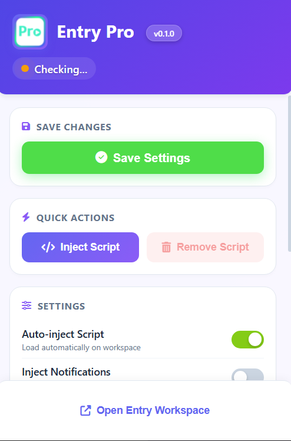

# EntryPro


EntryPro - Unofficial Blocks Auto-Injector for playentry.org

EntryPro is an unofficial tool designed to automatically inject unoficial and custom blocks into the playentry.org platform. This tool aims to enhance the user experience by providing additional functionalities and features that are not available in the standard version of playentry.org.

**Current Status**: 0.1.0 - Currently supports NPI Blocks v1.6

The current system has been provisionally built to automatically insert NPI blocks. Once EntryPro blocks are built, we plan to build a system that automatically inserts EntryPro blocks.

## Table of Contents

- Getting Started
- Features
- Installation
- Usage
- Troubleshooting
- Contributing
- Reference
- Copyright and License

## Getting Started

### Libraries

#### Chrome Extension

- `Manifest Version` - 3

- `Extension Version` - 0.1.0

- `Minimum Chrome` - 88+

#### Chrome APIs

- `chrome.scripting` - scripting

- `chrome.storage.sync` - storage

- `chrome.tabs` - activeTab

#### External libraries

- `Font Awesome` - 6.4.0

#### Internal components

- `EntryPro Extension` - 0.1.0

- `NPI Blocks` - 1.6

#### Host Permissions

- `playentry.org/*` - Full access

#### Development environment

- `JavaScript` - ES6+

- `HTML` - 5

- `CSS` - 3

## Features

- `Auto-injection`: Automatically injects NPI blocks when accessing Entry workspace
- `Customizable Settings`: Control auto-injection, notifications, debug mode, and more through a popup.
- `Developer Mode`: Advanced tools for custom block management

### Unimplemented Features

EntryPro is currently in alpha version, so some features may be incomplete or unstable. We appreciate your understanding.

- `injectScript`: There is a bug where injection does not occur even if you press the removeScript button and then the injectScript button.

- `injectNofication`: The injectNofication setting in the popup settings is not implemented yet.

- `debugMode`: Even with Debug Mode disabled, there are still a lot of logs in the console.

- `Language`: Changing the language in the popup does not actually take effect.

- `displayCategory`: Changing the current displayCategory setting does not actually take effect.

- `pageStatusChecker`: Currently, the pageStatusChecker in the popup header is not working properly.

- `developerMode`: Developer Mode is not currently implemented.

If you find more bugs or unimplemented features, please report them in issuses.

## Installation

### From Chrome Web Store (Recommended)

Currently, installation from the Chrome Web Store is not possible. Please use manual installation.

### Manual Installation

1. Clone this repository

```bash
git clone https://github.com/(your-username)/EntryPro.git
```

2. Open Chrome and go to `chrome://extensions/`
3. Enable **Developer mode** (top right)
4. Click **Load unpacked**
5. Select the downloaded folder

## Usage

### Basic Operation

1. `Accessing Entry Workspace`:

   - Navigate to [playentry.org/ws](https://playentry.org/ws) or any Entry workspace page
   - The extension will automatically detect the workspace and show its status

2. `Using the Popup Interface`:

   - Click the EntryPro icon in your Chrome toolbar to open the popup
   - Check the status indicator to verify NPI blocks are loaded
   - Use the green **Save** button to preserve your settings

### Popup Features

#### Popup Image



#### Quick Actions

- `Inject Script Now`: Manually inject NPI blocks immediately
- `Remove Script`: Remove NPI blocks and reset to default Entry

#### Settings Configuration

- `Auto-inject Script`: Toggle automatic injection on workspace pages
- `Inject Notifications`: Control success alert display
- `Display Categories`: Enable/disable specific block categories:
  - **Start**
  - **Flow**
  - **Moving**
  - **Looks**
  - **Brush**
  - **Text**
  - **Sound**
  - **Judgement**
  - **Calculation**
  - **Variable**
  - **Function**
  - **Analysis**
  - **AI Utilize**
  - **Expansion**
  - **Arduino**
  - **NPI**
- `Reset All Settings`: Reset Settings
- `Debug Mode`: Enable detailed console logging for troubleshooting
- `Developer Mode`: Unlock advanced features (see below)
- `Language Settings`: Switch between multiple interface languages

#### Developer Mode (Advanced)

`Warning: Developer features require explicit confirmation and are intended for advanced users only.`

When Developer Mode is enabled:

1. Enable Developer Mode.
2. Wait 10 seconds and click the "I know what I'm doing" button.

Feather of Developer Mode:

- **Add Blocks**: Create custom blocks
- **Add Categories**: Create new block categories
- **Delete Blocks**: Remove custom blocks
- **Delete Categories**: Remove custom categories

### Automatic Injection Flow

1. User visits `https://playentry.org/ws/`.
2. EntryPro detects workspace.
3. Checks auto-inject setting `(default: ON)`.
4. If enabled Injects NPI blocks.
5. Updates status indicator.
6. Blocks available in Entry workspace.

## Troubleshooting

| Issue                | Solution                                                                          |
| -------------------- | --------------------------------------------------------------------------------- |
| Blocks not appearing | 1. Check status in popup<br>2. Click "Inject Script Now" or Refresh the page      |
| Popup not opening    | 1. Ensure extension is enabled (`chrome://extensions`)<br>2. Reload the extension |
| Console errors       | Enable Debug Mode in settings and check Browser Console                           |

## Contributing

We welcome contributions to EntryPro! Here's how you can help:

### Ways to Contribute

#### Code Contributions:

- New Block Development: Create new custom blocks for Entry
- Bug Fixes: Identify and fix issues in the extension
- Feature Development: Add new features to the popup
- Code Optimization: Improve performance and efficiency
- Documentation: Improve README, comments, and guides

#### Non-Code Contributions:

- Block Ideas: Suggest new block categories and functionalities
- Testing: Test the extension and report bugs
- Design: Improve UI/UX design
- Translation: Help translate to other languages
- Documentation: Write tutorials and guides

#### Development Setup

###### Fork the repository on GitHub

##### Clone your fork locally:

```bash
git clone https://github.com/(your_username)/EntryPro.git
cd EntryPro
```

##### Create a new branch for your feature:

```bash
git checkout -b feature/(your-feature-name)
```

###### Make your changes and test them

##### Commit and push your changes:

```bash
git add .
git commit -m "Add: your feature description"
git push origin feature/(your-feature-name)
```

###### Create a Pull Request on GitHub

## Reference

The block addition library is referenced from EntryJS Docs.

- [EntryJS Documentation](https://docs.playentry.org/)
- [EntryJS GitHub Repository](https://github.com/entrylabs/entryjs)

The block addition method is based on NPI by **경찰 악어씨**.

- [NPI Blocks v1.6 Guide](https://playentry.org/community/tips/6929b651c4abc99dd4e24c47)
- [경찰 악어씨's Profile](https://playentry.org/profile/683c3803cf1a83502cb03fa4?sort=created&term=all&isOpen=all)

## Copyright and License

EntryPro Copyright (c) 2026 D4rkSt4rGod.

Licensed under the Apache License, Version 2.0 (the "License"); you may not use this file except in compliance with the License. You may obtain a copy of the License at

```
http://www.apache.org/licenses/LICENSE-2.0
```

or LICENSE file

Unless required by applicable law or agreed to in writing, software distributed under the License is distributed on an "AS IS" BASIS, WITHOUT WARRANTIES OR CONDITIONS OF ANY KIND, either express or implied. See the License for the specific language governing permissions and limitations under the License.
